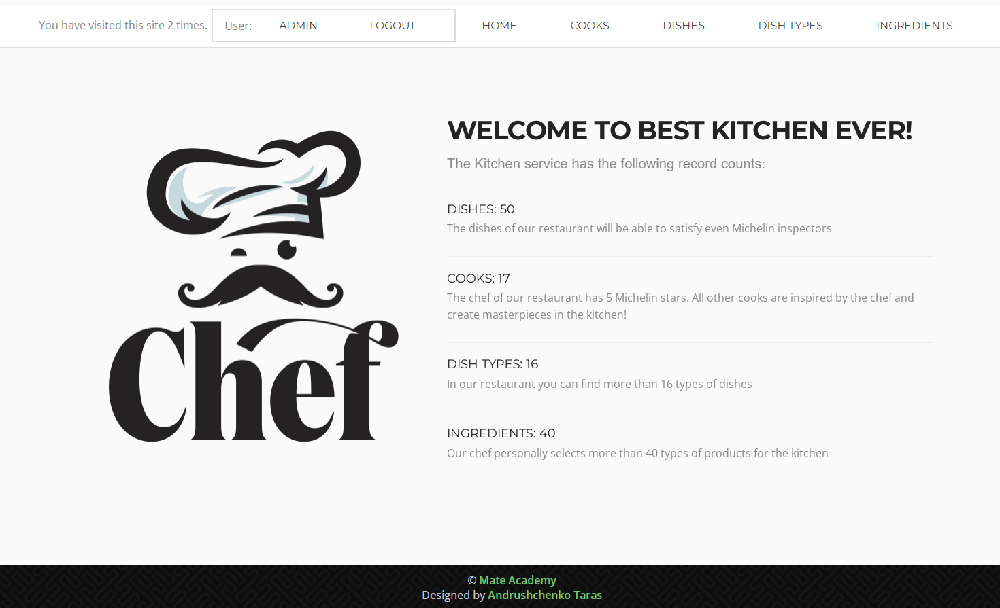

"# Restaurant-kitchen-servise" 

Django project for managing dishes, cooks, dish types and ingredients in Restaurant kitchen

## Check it out!

[Restaurant project deployed to Render](https://restaurant-kitchen-serv.onrender.com/)

## Installation

Python 3 must be already installed

```shell
git clone https://github.com/taras-andruschenko/Restaurant-kitchen-servise
cd Restaurant-kitchen-servise
python3 -m venv venv
source venv/bin/activate
pip install -r requirements.txt
python manage.py runserver # starts Django Server
```

## Features
* Authentication functionality for Cook/User
* Managing cooks dishes ingredients & dish types directly from website
* Powerful admin panel for advanced managing

## Demo


